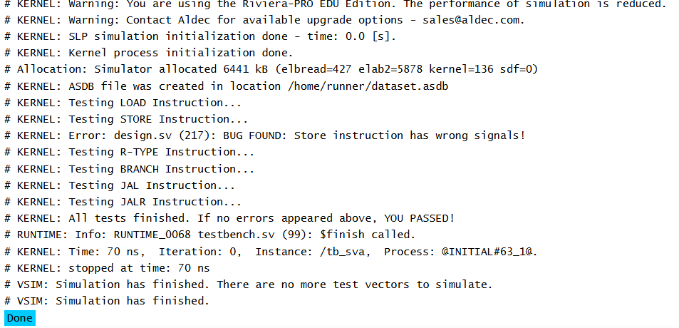
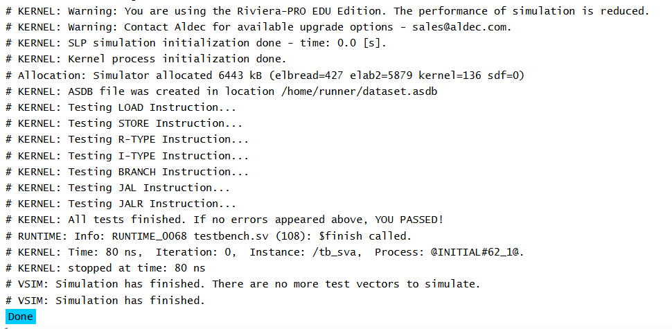
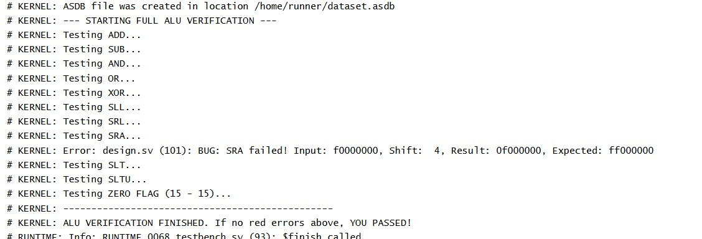
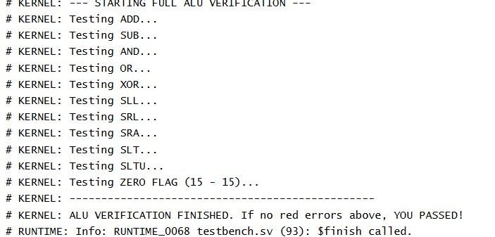

# Single-Cycle RISC-V Processor & Formal Verification (RV32I)

## Project Overview
This repository hosts the complete engineering lifecycle for a Single-Cycle RISC-V Processor. The project is divided into two distinct modules:
1.  **RTL Design:** A synthesizable Verilog implementation of the RV32I Core.
2.  **Formal Verification:** A robust Assertion-Based Verification (ABV) environment using SystemVerilog Assertions (SVA) to mathematically validate logic correctness.

---

## Module 1: RTL Design (The CPU)
**Location:** [`/rtl`](./rtl)

A fully functional Single-Cycle RISC-V processor core designed in Verilog. This architecture implements the complete **RV32I Base Integer Instruction Set**, capable of handling arithmetic, logic, memory access, and complex control flow.

### Architecture Features
* **Instruction Set:** Supports R-Type, I-Type, S-Type, B-Type, U-Type, and J-Type instructions.
* **Universal ALU:** Handles 10 operations including signed/unsigned comparisons (`SLT`/`SLTU`) and arithmetic shifts (`SRA`).
* **Smart Data Memory:** Byte-addressable memory supporting Word (`LW`/`SW`), Half-Word (`LH`/`SH`), and Byte (`LB`/`SB`) access with correct sign extension logic.
* **Control Flow:** Full support for conditional branching (`BEQ`, `BNE`, `BLT`, `BGE`) and unconditional jumps (`JAL`, `JALR`) using a dedicated 3-way PC Multiplexer.
* **Immediate Generation:** Specialized hardware unit to unscramble and sign-extend 12-bit and 20-bit immediates.

### Design Modules
1.  **Datapath (`datapath.v`):** Top-level integration wiring the PC, ALU, RegFile, and Memory.
2.  **Control Unit (`control_unit.v`):** Main decoder generating control signals based on Opcode/Funct3/Funct7.
3.  **Register File (`register_file.v`):** 32x32-bit dual-read port, single-write port memory.
4.  **Data Memory (`data_memory.v`):** 1KB RAM with read-modify-write logic for sub-word access.
5.  **Immediate Generator (`imm_gen.v`):** Combinational logic for immediate value extraction.

---

## Module 2: Formal Verification (The Police)
**Location:** [`/Verification`](./Verification)

I implemented a robust **Assertion-Based Verification (ABV)** environment using **Aldec Riviera-PRO**. Unlike standard simulation which checks one specific program, this environment strictly enforces mathematical properties to prevent illegal states across all possible inputs.

### Key Verification Features
* **Control Unit Safety:**
    * Formally proved **Mutual Exclusion** (e.g., `MemRead` and `MemWrite` never active simultaneously).
    * Enforced **State Safety** (e.g., Branch instructions must never trigger `RegWrite`).
* **ALU Data Integrity:**
    * Validated **Signed vs. Unsigned** logic (SLT vs SLTU).
    * Verified **Sign Extension** correctness for Arithmetic Shifts (SRA) vs Logical Shifts (SRL).
    * Implemented bi-directional **Zero Flag** assertions.

### Verification Evidence

#### 1. Control Unit Verification
**Scenario:** Validating that STORE instructions never accidentally trigger a Register Write.
* **Fault Injection:** I injected a bug setting `RegWrite=1` during a STORE operation. The SVA property `check_store_logic` immediately caught the violation.
  
* **Pass Confirmation:** After reverting to the Golden Model, all temporal properties passed.
  

#### 2. ALU Verification
**Scenario:** Validating Arithmetic Shift Right (`>>>`) vs Logical Shift Right (`>>`).
* **Fault Injection:** I changed the operator to `>>` (Logical Shift). The SVA property `check_sra` detected the signedness mismatch.
  
* **Pass Confirmation:** After fixing the logic and using `$unsigned` casting for verification, the ALU achieved 100% coverage.
  

---

## Functional Testing (RTL Simulation)
The core logic was initially verified using a self-checking assembly test suite (`program.hex`) that validates:
* Register Read/Write integrity.
* Memory Load/Store operations (Byte/Half/Word).
* Branching and Jumping logic.

### How to Run RTL Simulation (Icarus Verilog)
1.  **Install Icarus Verilog:**
    ```bash
    # MacOS
    brew install icarus-verilog
    # Linux
    sudo apt-get install iverilog
    # Windows: Download from [https://bleyer.org/icarus/](https://bleyer.org/icarus/)
    ```

2.  **Compile the Design:**
    ```bash
    iverilog -o cpu_core rtl/*.v tb_datapath.v
    ```

3.  **Run Simulation:**
    ```bash
    vvp cpu_core
    ```

### How to Run Formal Verification (SystemVerilog)
*Requires a simulator that supports SystemVerilog Assertions (e.g., Aldec Riviera-PRO, Questasim, or Synopsys VCS).*
1.  Load the design files from `rtl/`.
2.  Load the assertion files from `Verification/`.
3.  Run the testbench `tb_alu_sva.sv` (for ALU) or `tb_sva.sv` (for Control).


